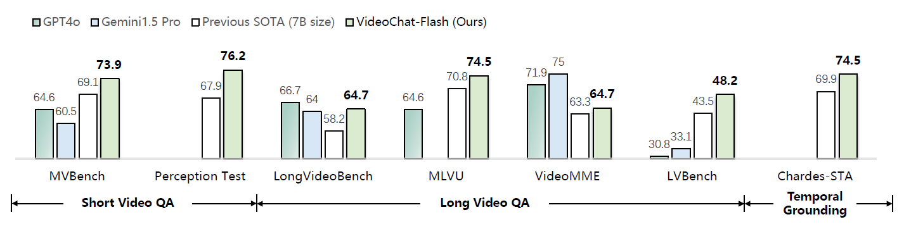
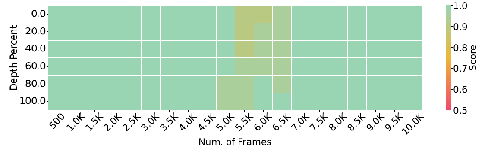
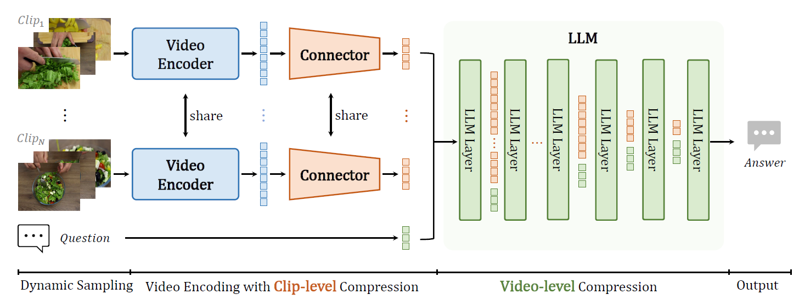

<div align="center">

<h2><a href="">VideoChat-Flash: Hierarchical Compression for Long-Context Video Modeling</a></h2>

[Xinhao Li](https://scholar.google.com/citations?user=evR3uR0AAAAJ&hl=zh-CN), [Yi Wang](https://scholar.google.com.hk/citations?hl=zh-CN&user=Xm2M8UwAAAAJ), [Jiashuo Yu](https://scholar.google.com.hk/citations?user=iH0Aq0YAAAAJ&hl=zh-CN&oi=ao), Xiangyu Zeng, Yuhan Zhu, Haian Huang, Jianfei Gao, [Kunchang Li](https://scholar.google.com/citations?user=D4tLSbsAAAAJ), [Yinan He](https://dblp.org/pid/93/7763.html), Chenting Wang, [Yu Qiao](https://scholar.google.com/citations?user=gFtI-8QAAAAJ&hl), [Yali Wang](https://scholar.google.com/citations?user=hD948dkAAAAJ), and [Limin Wang](https://scholar.google.com/citations?user=HEuN8PcAAAAJ)

</div>


## :parrot: Introduction

**State-of-the-art performance** in short and long video understanding, with temporal localization capabilities comparable to expert models.

**Supports ultra-long video inputs**, achieving a groundbreaking needle-in-a-haystack evaluation accuracy of **99.1% on 10,000 frames**, capable of processing videos up to three hours long.

**Highly efficient model architecture** with exceptional inference speed, encoding each video frame into just **16 tokens**, making it **5–10** times faster than the previous model.




## :fire: Updates
- **2024/12/29**: Release **VideoChat2-Flash** and **MH-NIAH**:
    - VideoChat-Flash is a powerfull baseline built on [UMT](https://github.com/OpenGVLab/unmasked_teacher) and Qwen2-7B.
    - [MH-NIAH](./BENCHMARK.md) is a comprehensive benchmark for video understanding.


## Inference & Demo


## Evaluation Results


We modify lmms-eval to eval ..

## Short-to Long Training


### [Instruction Data](./DATA.md)

We build a diver instruction data with **2M** samples from 34 distince sources. Check [DATA](./DATA.md) for more details.

### Model

| Stage | Num. frames | ViT | Connector | LLM | Shell |
|--------|:-------:|:------:|:------:|:------:|:------:|
| Stage-1 | 4 | :snowflake: | :fire: | :snowflake: | TBD |
| Stage-2 | 4-8 | :fire: | :fire: | :fire: | TBD |
| Stage-3 | 64-512 | :fire: | :fire: | :fire: | TBD |
| Stage-4 | 64-512 | :fire: | :fire: | :snowflake: | TBD |


## :bar_chart: [Multi-Hop NIAH](./BENCHMARK.md)


# :page_facing_up: Citation

If you find this project useful in your research, please consider cite:
```BibTeX

```

# :dizzy: Acknowledgement

<!-- Thanks to the open source of the following projects:

[InternVideo](https://github.com/OpenGVLab/InternVideo), [UMT](https://github.com/OpenGVLab/unmasked_teacher), [Qwen](https://github.com/Vision-CAIR/MiniGPT-4), [LLaVA-VL](https://github.com/Vision-CAIR/MiniGPT-4) -->